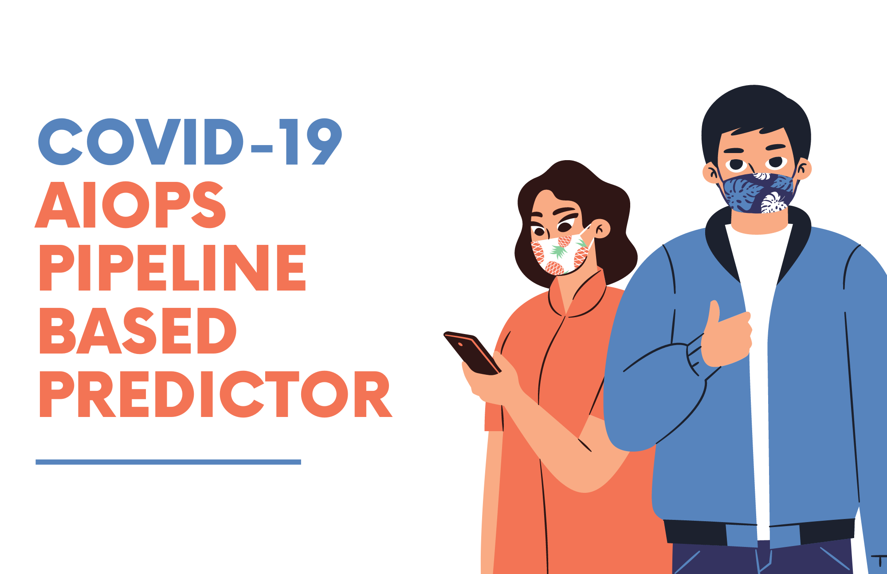
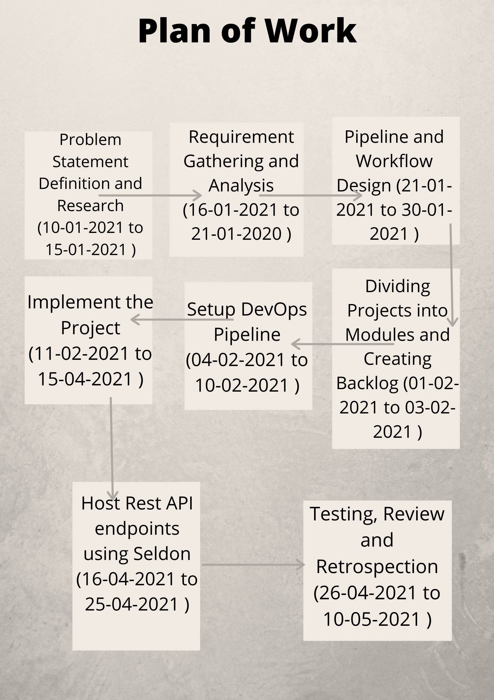

<h1 align="center">Covid-19 Predictor</h1>
<h5 align="center">@NishkarshRaj @krannaut @rishabhnegi22 @megharawat3</h3>

  

### Create the Model from Scratch

### See Metrics of the Model

### Perform Prediction with Trained Model

### Seldon Rest API

### Do it Yourself: ModelDB x MLflow Workflow for End-to-End MLOps Pipeline

#### Tools

  

#### Plan of Action

  

#### Backlog

- [x] Create GitHub Repository
- [x] Build Covid Predictor Model using PyTorch 
- [x] Implement Predictor for the Model
- [x] Implement Model Metrics Detector
- [x] Expose the Predictor as Rest Endpoint using Seldon
- [x] Create a ModelDB x MLflow AIOps Pipeline for onboarding the model  

#### References

* [Pre-Trained Model](https://drive.google.com/file/d/11UUIpfpSnJdZ2axT4hlQAJliLf4U-FNk/view)
* [Covid Dataset](https://github.com/UCSD-AI4H/COVID-CT)

#### License

Open Source under [MIT License](LICENSE)
